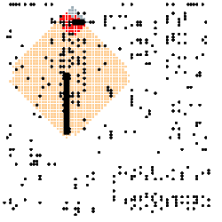
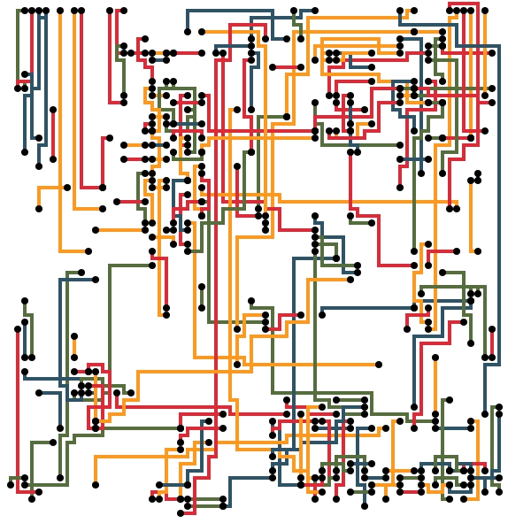
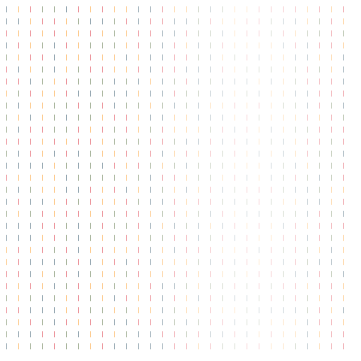
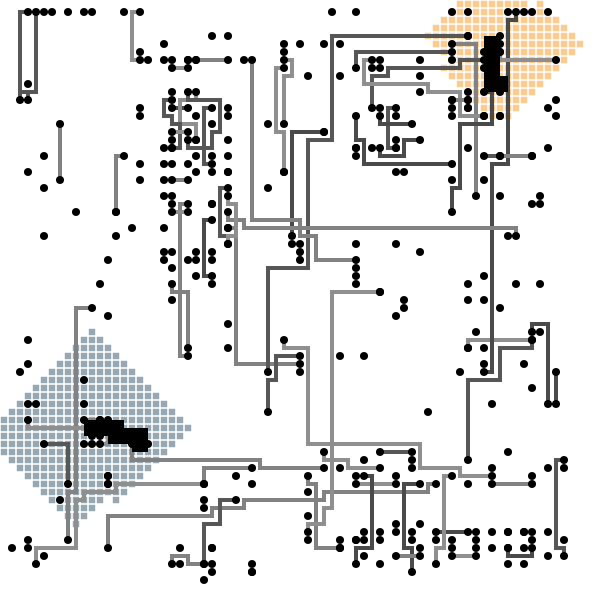
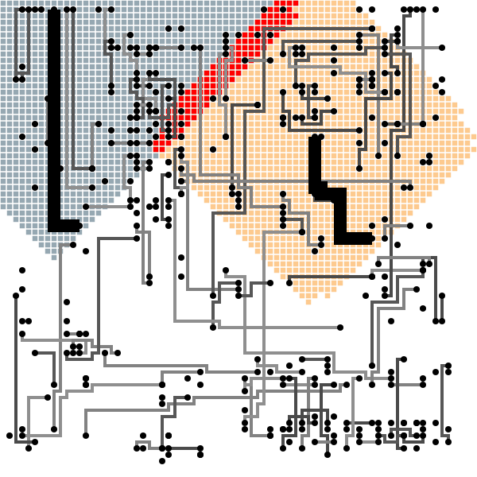
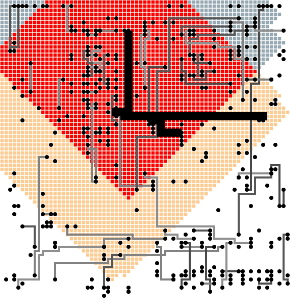
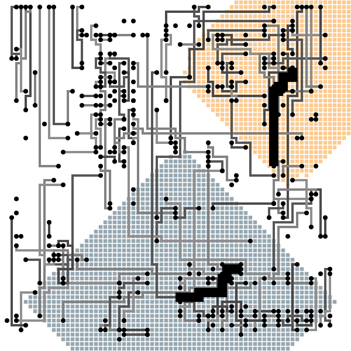

# Ruby STM Lee Demo



This is a demo of using *Software Transactional Memory*, or *STM*, in Ruby to parallelise an algorithm for routing circuits called *Lee's Algorithm*. It shows some interesting points for discussion.

## Usage

```
% bundle exec ruby 1-draw-empty-board.rb inputs/testBoard.txt testBoard.svg
routes: 203

% bundle exec ruby 2-expensive-solution.rb inputs/testBoard.txt testBoard.svg
routes: 203
cost:   4168
depth:  5

% bundle exec ruby 3-sequential-lee.rb inputs/testBoard.txt testBoard.svg
routes: 203
cost:   3304
depth:  3

% bundle exec ruby 4-transactional-lee.rb inputs/testBoard.txt testBoard.svg testBoard-expansions
routes:      203
independent: 79
overlaps:    9
conflicts:   27
spare:       0
cost:        3307
depth:       3
```

You'll need to use a build of the `thread_tvar` branch of MRI, with `instrument-atomically.patch` which applies cleanly on top of at least `66e45dc50c05d5030c8f9663bb159b8e2014d8ff`, in order to run the next two commands.

```
% bundle exec ruby 5-sequential-tvar-lee.rb inputs/testBoard.txt testBoard.svg
routes:      203
cost:        3304
depth:       3

% bundle exec ruby 6-concurrent-tvar-lee.rb inputs/testBoard.txt testBoard.svg
routes:      203
committed:   203
aborted:     7
cost:        3308
depth:       3
```

## Rendering

The SVGs produced aren't very efficient I'm afraid. You may be better off converting them to PNG.

```
% qlmanage -t -s 1000 -o testBoard-expansions testBoard-expansions/*.svg
```

You can also make an animated GIF.

```
% convert -scale 250 -delay 10 -loop 1 testBoard-expansions/*.png testBoard.gif
```

## Inputs

#### `minimal.txt`

Simple enough to reason about manually. Two crossing routes. Note how the algorithm does not find the lowest-cost solution!


```
routes:      2
independent: 0
overlaps:    0
conflicts:   1
spare:       1
cost:        24
depth:       2
```

#### `testBoard.txt`

A small but realistic board.



```
routes:      203
independent: 79
overlaps:    9
conflicts:   27
spare:       0
cost:        3307
depth:       3
```

#### `memboard.txt`

A memory module, so many shorter routes.


```
routes:      3101
independent: 1459
overlaps:    41
conflicts:   100
spare:       1
cost:        162917
depth:       3
```

#### `mainboard.txt`

A processor module, so more longer routes.


```
routes:      1506
independent: 630
overlaps:    34
conflicts:   177
spare:       1
cost:        174128
depth:       3
```

#### `sparselong.txt`

Very long routes, which will likely conflict.


```
routes:      29
independent: 0
overlaps:    0
conflicts:   28
spare:       1
cost:        16849
depth:       1
```

#### `sparseshort.txt`

Very short routes, which will likely not conflict.



```
routes:      841
independent: 419
overlaps:    1
conflicts:   1
spare:       0
cost:        9251
depth:       1
```

### Sources

Inputs are from http://apt.cs.manchester.ac.uk/projects/TM/LeeBenchmark/, who in turn got them from Spiers [1]. They're described as 'typical production' boards but we're not sure where exactly they came from

> Unless otherwise mentioned, the code copyright is held by the University of Manchester, and the code is provided "as is" without any guarantees of any kind and is distributed as open source under a BSD license.

`inputs/minimal.txt` by Chris Seaton.

[1] T D Spiers and D A Edwards. A high performance routing engine. In Proceedings of the 24th ACM/IEEE conference on Design Automation, pages 793–799, 1987.

## Example transactions

Two clearly independent routes that can be solved completely in parallel.



Two routes that overlap in what they read, but not what they write, so can be solved in parallel.



A massive conflict, that could never be solved in parallel.



A surprisingly large read-set for a small route, showing how unpredictable the area required is.



## Compatibility

Works on at least:

* MRI 2.7.2
* MRI `66e45dc50c05d5030c8f9663bb159b8e2014d8ff` + patch
* JRuby 9.2.13.0
* TruffleRuby 20.2.0

## Performance

We don't think there's much point looking at the performance of `TVar` in MRI yet - it's experimental. But it's interesting to compare Ruby implementations on the sequential solver. We can see how JRuby is 2x faster, and TruffleRuby is an order of magnitude faster.

| Ruby | Result | Relative speedup |
|--|--|--|
| `ruby 2.7.2p137 (2020-10-01 revision 5445e04352) [x86_64-darwin19]` | 0.918  (± 0.0%) i/s | 1.00x |
| `ruby 2.7.2p137 (2020-10-01 revision 5445e04352) +JIT [x86_64-darwin19]` | 1.101  (± 0.0%) i/s | 1.20x |
| `ruby 3.0.0dev (2020-10-12T07:16:50Z thread_tvar 66e45dc50c) [x86_64-darwin19]` | 0.836  (± 0.0%) i/s | 0.91x |
| `jruby 9.2.13.0 (2.5.7) 2020-08-03 9a89c94bcc OpenJDK 64-Bit Server VM 25.252-b14 on 1.8.0_252-b14 +jit [darwin-x86_64]` | 2.002  (± 0.0%) i/s | 2.18x |
| `jruby 9.2.13.0 (2.5.7) 2020-08-03 9a89c94bcc OpenJDK 64-Bit Server VM 25.252-b14 on 1.8.0_252-b14 +indy +jit [darwin-x86_64]` | 2.549  (± 0.0%) i/s | 2.78x |
| `truffleruby 20.2.0, like ruby 2.6.6, GraalVM CE Native [x86_64-darwin]` | 11.238  (±26.7%) i/s | 12.24x |
| `truffleruby 20.2.0, like ruby 2.6.6, GraalVM CE JVM [x86_64-darwin]` | 9.475  (±10.6%) i/s | 10.32x |

## Author

Written by Chris Seaton at Shopify, chris.seaton@shopify.com.

## License

MIT
